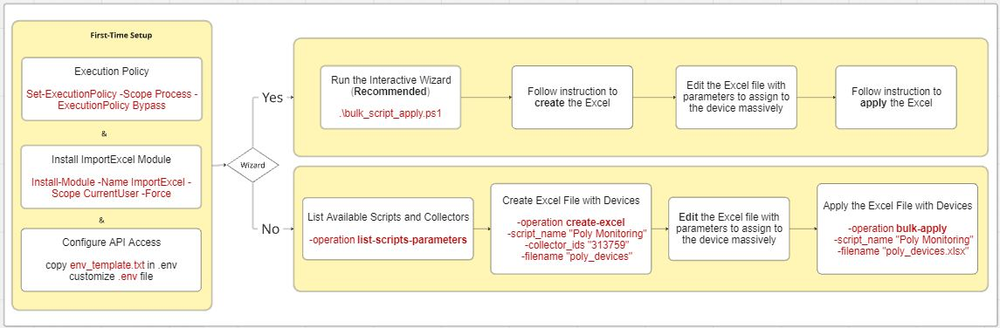

# Domotz Automation Scripts - Bulk Apply Tool

A PowerShell tool designed to bulk apply Domotz Custom Scripts to multiple devices across multiple collectors.

The PowerShell script allows you to associate, dissociate, or update the parameters of a script assignment for any number of devices belonging to various collectors within the same account.

While the script can update many devices at once, it operates on a single script per run, which you can select through the wizard phase or by manually entering the script name in the command line.

## Workflow Overview

The following picture shows the complete workflow:



The following sections provide detailed information on setup and usage.

---

## System Requirements - Mandatory Requirements

- **Windows PC** - This script only runs on Windows
- **PowerShell** - Pre-installed on Windows
- **Microsoft Excel** - Must be installed on the PC
- **ImportExcel Module** - PowerShell module (installation instructions below)

## First-Time Setup

### Step 1: Execution Policy

Before running any PowerShell script, you need to allow script execution:

```powershell
Set-ExecutionPolicy -Scope Process -ExecutionPolicy Bypass
```

When prompted, respond with:

- `Y` (for Yes) - Allow for this session only
- `A` (for All) - Allow for all scripts in this session

> **Note:** This only affects the current PowerShell session and doesn't change your system-wide settings.

### Step 2: Install ImportExcel Module

**Check if already installed:**

```powershell
Get-Module -ListAvailable -Name ImportExcel
```

**If not installed:**

```powershell
Install-Module -Name ImportExcel -Scope CurrentUser -Force
```

### Step 3: Configure API Access

Create a file named `.env` in the same folder as the script:

```env
API_KEY='your_actual_api_key'
BASE_URL='https://api-us-east-1-cell-1.domotz.com/public-api/v1'
```

**BASE_URL by Region:**

- **US Region:** `https://api-us-east-1-cell-1.domotz.com/public-api/v1`
- **EU Region:** `https://api-eu-west-1-cell-1.domotz.com/public-api/v1`

> **Tip:** Get your API key from Domotz account settings. See [Domotz API Documentation](https://help.domotz.com/admin-global-features/domotz-api/) for details.

## Getting Help

### View Usage Information

To see complete usage instructions and available operations:

```powershell
.\bulk_script_apply.ps1 -help
# or
.\bulk_script_apply.ps1 -?
```

You can:

- Run the Wizard or (**Recommended**) <u>or</u>

- Manual Workflow (w/o Wizard)

## Run the Wizard (Recommended)

Running the script **without any parameters** launches an interactive wizard that guides you through all required steps:

```powershell
.\bulk_script_apply.ps1
```

Follow the prompts to create and execute your first command!

The wizard will:

1. Show usage information
2. Ask if you want help creating the first command
3. Display available scripts (numbered for easy selection)
4. Show available collectors (numbered)
5. Build the correct command for you
6. Offer to execute it immediately or let you run it manually

---

## Manual Workflow (w/o Wizard)

### List Available Scripts and Collectors

```powershell
.\bulk_script_apply.ps1 -operation list-scripts-parameters
```

Shows:

- All custom drivers/scripts in your account
- All collectors/agents in your account

### Create Excel File with Devices

**From specific collectors:**

```powershell
.\bulk_script_apply.ps1 -operation create-excel `
    -script_name "Poly Monitoring" `
    -collector_ids "313759,312189"
```

**From ALL collectors in your account:**

```powershell
.\bulk_script_apply.ps1 -operation create-excel `
    -script_name "Poly Monitoring"
```

**With custom filename:**

```powershell
.\bulk_script_apply.ps1 -operation create-excel `
    -script_name "Poly Monitoring" `
    -collector_ids "313759" `
    -filename "poly_devices"
```

**What happens:**

- Retrieves all devices from specified collectors (or all collectors if not specified)
- Creates Excel file with device information
- Adds columns for script parameters
- Marks required fields in **RED text**
- **Auto-opens the file** for editing
- Displays the **next command** to run

### Edit the Excel File

The Excel file opens automatically. Fill in **ALL columns with RED headers**:

- `_operation_` - **Required**: Specify the operation to perform on the device:
  - `Associate` - Associate the script with the device
  - `DeleteAssociation` - Remove the script association from the device
  - `UpdateParameters` - Update parameters for an existing script association
- `username`, `password` - If script requires credentials
- Script-specific parameters (e.g., `client_id`, `client_secret`)
- `sample_period` - Must be ≥ `_minimal_sample_period_`

> **Important:** Rows with missing required parameters or invalid `_operation_` values will be **SKIPPED** during bulk-apply.

### Apply Script to All Devices

```powershell
.\bulk_script_apply.ps1 -operation bulk-apply `
    -script_name "Poly Monitoring"
```

**With specific filename:**

```powershell
.\bulk_script_apply.ps1 -operation bulk-apply `
    -script_name "Poly Monitoring" `
    -filename "poly_devices.xlsx"
```

**Enable debug mode:**

```powershell
.\bulk_script_apply.ps1 -operation bulk-apply `
    -script_name "Poly Monitoring" `
    -debug
```

> **Note:** Debug mode shows detailed API call information and parameter mapping for troubleshooting.

### Review Results

The Excel file is updated with results:

| Status                     | Color          | Meaning                          |
| -------------------------- | -------------- | -------------------------------- |
| **OK**                     | 🟢 Green Bold  | Successfully processed           |
| **Error**                  | 🔴 Red Bold    | Failed - see `_messages_` column |
| **Skipped**                | 🟠 Orange Bold | Missing required parameters      |
| **Script already applied** | 🟢 Green Bold  | Device already has this script   |

Fix any skipped/failed rows and re-run `bulk-apply` to process them.

---

## Available Operations

| Operation                 | Description                      | Required Parameters | Optional Parameters                           |
| ------------------------- | -------------------------------- | ------------------- | --------------------------------------------- |
| `list-scripts-parameters` | List all scripts and collectors  | None                | None                                          |
| `create-excel`            | Generate Excel file with devices | `-script_name`      | `-collector_ids` (if omitted, uses all)<br>`-filename` |
| `bulk-apply`              | Apply script to devices in Excel | `-script_name`      | `-filename`<br>`-debug`                       |

---

## Understanding the Excel File

### Column Types

**Information Columns** (auto-populated, prefixed/suffixed with `_`):

- `_collector_name_`, `_device_display_name_` (clickable link), `_device_id_`
- `_device-status_`, `_vendor_`, `_model_`, `_type_`, etc.
- `_minimal_sample_period_` - Minimum value for `sample_period`

**Required Input Columns** (marked in RED):

- `_operation_` - Operation to perform: `Associate`, `DeleteAssociation`, or `UpdateParameters`
- `collector_id` - Collector/agent ID
- `ip_address` - Device IP address
- `username`, `password` - Only if script requires credentials
- Script-specific parameters (varies by script)
- `sample_period` - Polling interval (must be ≥ `_minimal_sample_period_`)

**Result Columns** (updated after bulk-apply):

- `_apply-result_` - Status (OK, Error, Skipped, Script already applied)
- `_messages_` - Details or error messages

### Parameter Types and Formatting

When filling in script parameters in the Excel file, use the correct format based on the parameter type:

**NUMBER Parameters:**

- Enter as plain numbers without quotes
- Example: `12345`

**STRING Parameters:**

- Enter text without quotes
- Example: `test test` or `my device name`
- Do NOT wrap in quotes like `"test test"`

**SECRET_TEXT Parameters:**

- Enter text without quotes (same format as STRING)
- Example: `my secret password` or `api_key_12345`
- These values will be **hidden in console output** during debug mode for security

**LIST Parameters:**

- Enter as a JSON array with values in square brackets
- Example: `["value1","value2"]` or `["192.168.1.1","192.168.1.2"]`
- Use double quotes around each value
- Separate multiple values with commas

> **Important:** Incorrect parameter formatting may cause errors during bulk-apply. Check the `_messages_` column if a row fails processing.

### Processing Logic

When you run `bulk-apply`:

1. **Empty `_apply-result_`** → Processed (if all parameters filled)
2. **Status = "OK", "Error", or "Script already applied"** → **SKIPPED** (already processed)
3. **Status = "Skipped"** → **RE-EVALUATED**
   - If all parameters now filled → Processed
   - If still missing parameters → Skipped again

This allows you to:

- Fix skipped rows and re-run without reprocessing successful ones
- Fill parameters gradually and run multiple times
- Resume after fixing errors

---

## Troubleshooting

### Script Won't Run - Execution Policy Error

**Error:** `...cannot be loaded because running scripts is disabled...`

**Solution:**

```powershell
Set-ExecutionPolicy -Scope Process -ExecutionPolicy Bypass
```

Respond `Y` or `A` when prompted, then run the script again.

### ImportExcel Module Not Found

**Error:** `The term 'Import-Excel' is not recognized...`

**Solution:**

```powershell
Install-Module -Name ImportExcel -Scope CurrentUser -Force
```

### Script Name Not Found

**Error:** `No custom driver/script found with name 'XXX'`

**Solution:**

- Run `list-scripts-parameters` to see available scripts
- Use the **exact name** (case-sensitive)
- Check for typos or extra spaces

### Excel File Is Open

**Error:** `The Excel file is currently OPEN...`

**Solution:**

The script detects if Excel is open and offers to close it automatically:

1. Type `Y` to let the script close Excel
2. If file has unsaved changes, choose to save or discard
3. Script continues automatically

**Or manually:**

- Close Excel completely
- Check Task Manager for lingering Excel processes
- Re-run the script

### Invalid Collector IDs

**Error:** `The following collector ID(s) are not valid...`

**What happens:**

- Script shows all valid collector IDs
- Asks if you want to correct the command
- Shows numbered list for easy selection
- Builds corrected command
- Offers to run it immediately

### Invalid Script Name

**Error:** `The script name 'XXX' is not valid`

**What happens:**

- Script shows all valid script names
- Asks if you want to correct the command
- Shows numbered list for easy selection
- Builds corrected command
- Offers to run it immediately

### Rows Marked as "Skipped"

**Problem:** Some devices show "Skipped" status

**Solution:**

1. Check `_messages_` column for missing parameters
2. Fill in the required fields (RED columns)
3. Re-run `bulk-apply` - only skipped rows will be reprocessed

### API Key Issues

**Error:** `401: Unauthorized`

**Solution:**

- Verify `.env` file is in the same folder as the script
- Check `API_KEY` is correct (no extra quotes/spaces)
- Ensure `BASE_URL` matches your region
- Verify API key is active in Domotz

---

## Advanced Features

### Multiple Collectors

**Process devices from specific collectors:**

```powershell
.\bulk_script_apply.ps1 -operation create-excel `
    -script_name "Network Monitor" `
    -collector_ids "313759,312189,315000"
```

**Process devices from ALL collectors in your account:**

```powershell
.\bulk_script_apply.ps1 -operation create-excel `
    -script_name "Network Monitor"
```

> **Note:** Omitting `-collector_ids` automatically extracts devices from all collectors in your account.

### Custom Filenames

Work with multiple Excel files simultaneously:

```powershell
# Create files for different purposes
.\bulk_script_apply.ps1 -operation create-excel `
    -script_name "Poly Monitoring" `
    -collector_ids "313759" `
    -filename "office_devices"

.\bulk_script_apply.ps1 -operation create-excel `
    -script_name "AV Monitor" `
    -collector_ids "312189" `
    -filename "meeting_rooms"
```

> **Note:** If a file already exists, a timestamp is automatically appended to avoid overwriting.

### Debug Mode

Use `-debug` flag for detailed troubleshooting information:

```powershell
.\bulk_script_apply.ps1 -operation bulk-apply `
    -script_name "Poly Monitoring" `
    -debug
```

Shows:

- Complete API request details (endpoint, headers, body)
- Parameter mapping information
- Device processing details

---

## Files Generated

- **Excel File:** `bulk_script_apply.xlsx` (or custom name)
- **Log File:** `bulk_script_apply_Log.txt`

The log file contains complete execution history, API calls, and error details for troubleshooting.

---

## FAQ

**Q: Can I edit Excel while the script is running?**  
A: No. Close Excel before running `bulk-apply`.

**Q: What happens if I change columns in Excel?**  
A: The script validates that columns match the script parameters. If mismatched, regenerate with `create-excel`.

**Q: Can I process the same device multiple times?**  
A: Yes, but you need to clear the `_apply-result_` column first. Otherwise, the row is skipped.

**Q: How do I remove a script association?**  
A: Set the `_operation_` column to `DeleteAssociation` in the Excel file and run `bulk-apply`.

**Q: Does this work with scheduled scripts?**  
A: Yes. The `sample_period` controls how often the script runs on each device.

**Q: What if I made a typo in the script name or collector ID?**  
A: The script detects this and offers an interactive correction wizard with numbered lists for easy selection.

---

## License

This script is provided "AS IS" for illustrative/educational purposes. See script header for full disclaimer.

---

## Additional Documentation

For detailed technical documentation, see [README_bulk_script_apply.md](README_bulk_script_apply.md)
